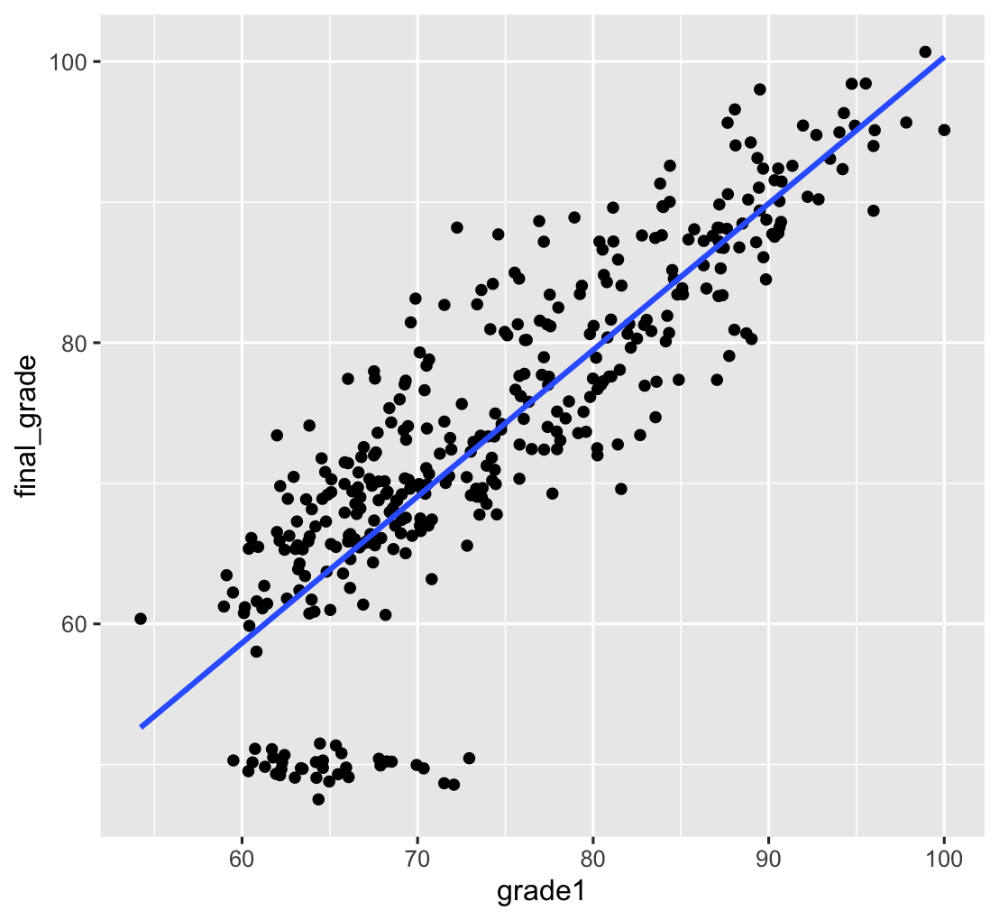
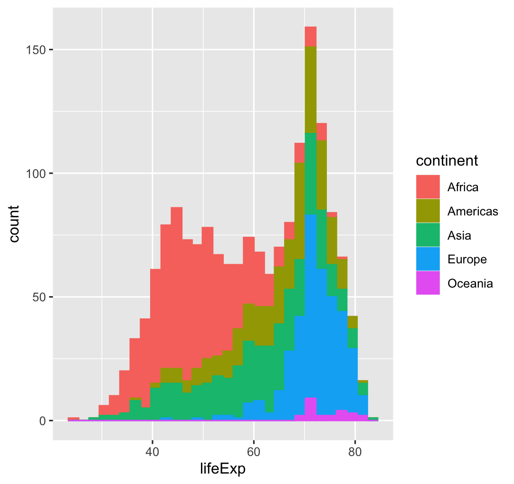
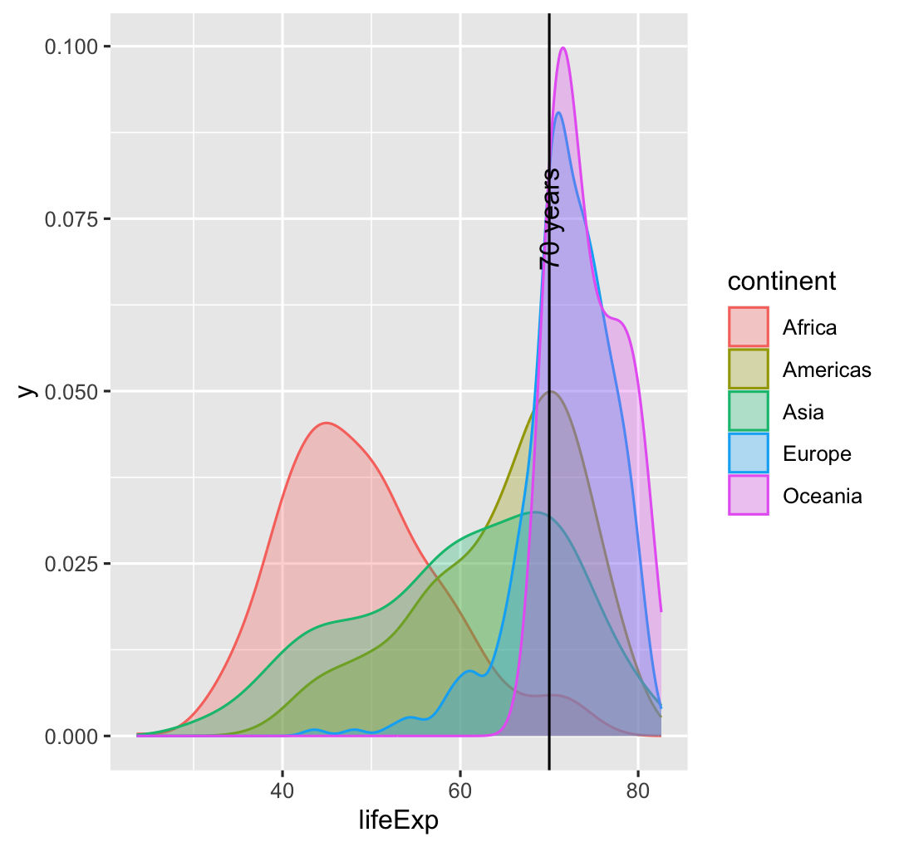
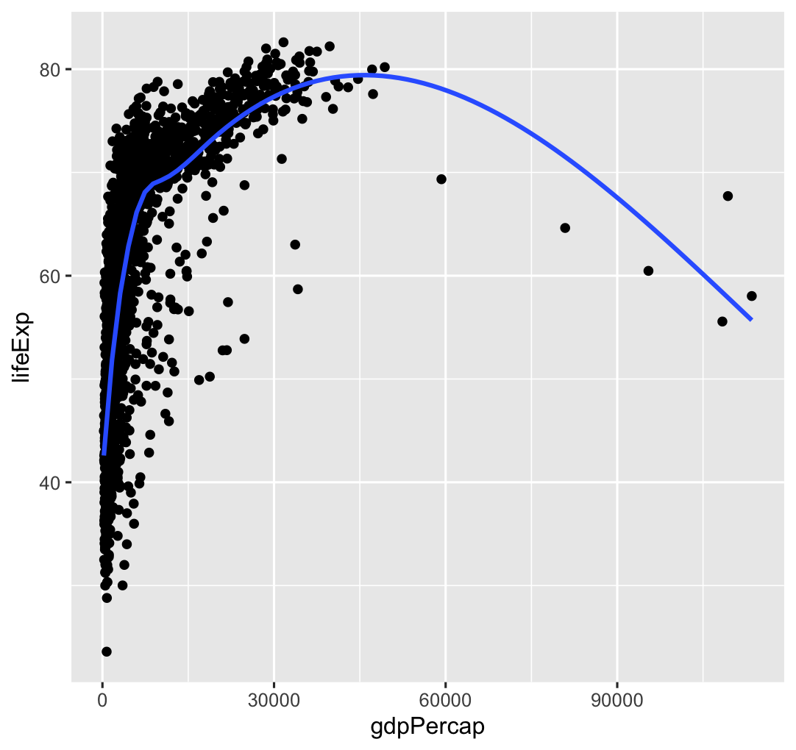
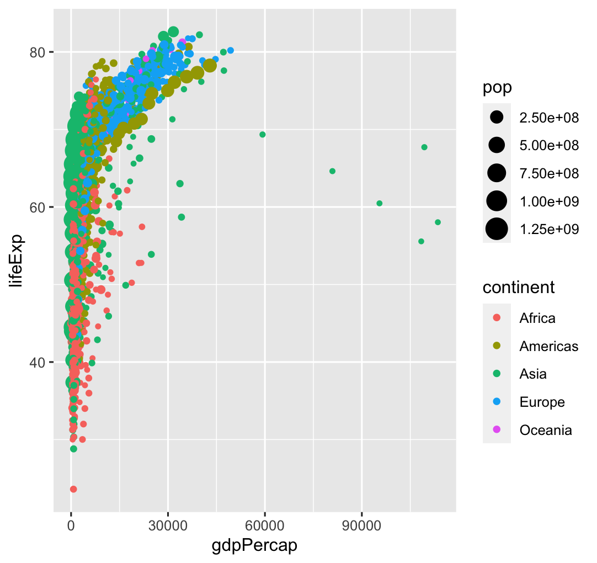

# RStudio-Project

Under the supervision of instructors Andrew Dickinson and Colleen O'Briant, I completed RStudio projects for EC 320 at the University of Oregon. These projects were completed by the programming language for statistical computing and graphics - RStudio.
<br>
<br>

Below is the overview of the projects:
<br>
<br>


***Tibble***
  - Intro to tidyverse table functions
  - Hold & create data set in Tibbles
  - Form data into a Tibbles

Example:
```shell
tibble(
  sex = c("male", "female", "female"),
  study_time = c(8, 4, 4),
  grade = c(78, 74, 86)
)
```
<table border="1">
 <tr> 
    <th></th>
    <th>sex</th>
    <th>study_time</th>
    <th>grade</th>
  </tr>
  <tr>
    <th>1</th>
    <td>male</td>
    <td>8</td>
    <td>78</td>
  </tr>
  <tr> 
    <th>2</th>
    <td>female</td>
    <td>4</td>
    <td>74</td>
 </tr>
 <tr> 
    <th>3</th>
    <td>female</td>
    <td>4</td>
    <td>86</td>
 </tr>
</table>
<br>
<br>


***lm***
  - Using ```lm()``` to estimate models with: log transformations, categorical variables using dummies, and interactions between variables, etc
  - ```broom:tidy``` and ```broom:glance()```

Example ```broom:tidy```:
```shell
lm(lifeExp ~ gdpPercap, data = gapminder) %>%
  broom::tidy(conf.int = TRUE)
```

```shell
# A tibble: 2 × 7
  term         estimate std.error statistic   p.value  conf.low conf.high
  <chr>           <dbl>     <dbl>     <dbl>     <dbl>     <dbl>     <dbl>
1 (Intercept) 54.0      0.315         171.  0         53.3      54.6     
2 gdpPercap    0.000765 0.0000258      29.7 3.57e-156  0.000714  0.000815
```
<br>
<br>


***line of best fit***
  - Express the relationship in the given scatter plot of different data points

Example:
```shell
students %>%
  ggplot(aes(x = grade1, y = final_grade)) +
  geom_point() +
  geom_smooth(method = "lm", se = FALSE)
```
  
<br>
<br>


***dplyr***
  - dplyr functions such as ```summarize()``` and ```group_by()```
  - Analyze data using ```filter()```, ```arrange()```, and ```mutate()```, etc
  - Combine two or more Tibbles by ```bind_rows()```, ```bind_cols()```, and ```left_join()```, etc

EX: What percentage of A students study for more than 10 hours per week?
```shell
students %>%
  filter(final_grade >= 90) %>%
  group_by(study_time) %>%
  summarize(n = n()) %>%
  mutate(percent = n / sum(n))
```
Outcome table:
```shell
# A tibble: 4 × 3
  study_time        n percent
  <fct>         <int>   <dbl>
1 less than 2H     10   0.294
2 2 - 5H           13   0.382
3 5 - 10H           7   0.206
4 more than 10H     4   0.118
```
<br>
<br>


***ggplot2***
  - Visualization of data such as Bar plot, Histogram, Box plot, and scatter plot, etc
  - Add a line of best fit in scatterplot

Example plots:
<div class="image-row">
  
  
</div>

<div class="image-row">
  
  
</div>
<br>
<br>


***ggplot - aes, geom***
  - Aesthetic mappings: map variables in the plot to different axes or different colors
  - Geom: Added the plot + as cayers

Examples plots:
<div class="image-row">
  
  
</div>

<div class="image-row">
  
  
</div>
